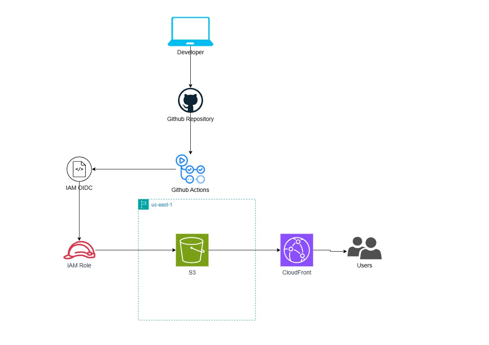

## Project Overview

This project implements a production-ready static website hosting solution on AWS, emphasizing Infrastructure as Code, security best practices, and automated deployment pipelines. The infrastructure eliminates the need for long-lived AWS credentials by leveraging OIDC authentication between GitHub Actions and AWS.

**Live Demo:** [https://d2jgqhup9totr6.cloudfront.net](https://d2jqghup9totr6.cloudfront.net)

**Static Website Repository:** [github.com/escanut/aws-s3-static-site-cicd](https://github.com/escanut/aws-s3-static-site-cicd)


## Architecture

### Infrastructure Components

**Storage & Hosting**
- S3 bucket configured for static website hosting
- Public access policies scoped to read-only operations
- Randomized bucket naming to ensure global uniqueness

**Content Delivery**
- CloudFront CDN distribution with edge caching
- Automatic HTTP to HTTPS redirection
- Default TTL optimization (1 hour) with configurable min/max
- PriceClass_100 (US, Canada, Europe) for cost efficiency

**Identity & Access Management**
- OIDC provider integration with GitHub Actions
- IAM role with least-privilege permissions scoped to specific repository and branch
- Federated authentication eliminating static credentials
- Granular S3 and CloudFront permissions

**State Management**
- Remote state stored in S3 with encryption
- DynamoDB table for state locking to prevent concurrent modifications
- Backend configuration ensures team collaboration safety


*CI/CD workflow from developer commit to production deployment*

---

## Key Technical Implementations

### 1. Secure Authentication with OIDC

**The Problem:** Traditional CI/CD pipelines require storing long-lived AWS access keys as GitHub secrets, creating security risks if repositories are compromised or secrets are leaked.

**The Solution:** OpenID Connect federation allows GitHub Actions to exchange short-lived tokens for temporary AWS credentials without storing any secrets to boost security posture.

```hcl
resource "aws_iam_openid_connect_provider" "github" {

  url = "https://token.actions.githubusercontent.com"

  client_id_list = ["sts.amazonaws.com"]

  thumbprint_list = 
  ["6938fd4d98bab03faadb97b34396831e3780aea1"]
}
```

**Trust Policy Configuration:**
- Scoped to specific repository: `repo:${github_username}/${repo_name}`
- Restricted to main branch: `:ref:refs/heads/main`
- Prevents unauthorized repositories from assuming the role

**Impact:** Eliminates credential rotation requirements and removes static credentials from the deployment pipeline entirely. AWS security best practices documentation recommends OIDC federation as the standard approach for CI/CD authentication.

---

### 2. Infrastructure as Code Best Practices

**Version Pinning for Stability**
```hcl
terraform {
  required_version = "~> 1.14"
  required_providers {
    aws = {
      source = "hashicorp/aws"
      version = "~> 6.28"
    }
  }
}
```

Uses pessimistic version constraints (`~>`) to allow patch updates while preventing breaking changes. This approach follows HashiCorp's recommendations for production infrastructure.

**Remote State with Locking**
```hcl
backend "s3" {

  bucket = "escanut-tf-state"

  key = "s3-website/terraform.tfstate"

  dynamodb_table = "tf-state-lock"

  encrypt = true
}
```

Implements collaborative infrastructure management with:
- Encrypted state storage
- DynamoDB-based locking prevents terraform race conditions
- Separate state bucket from application resources

---

### 3. CloudFront Optimization

**Custom Origin Configuration**

S3 website endpoints require `custom_origin_config` rather than standard S3 origin configuration because they function as HTTP servers, not S3 API endpoints.

```hcl
custom_origin_config {

  http_port = 80

  https_port = 443

  origin_protocol_policy = "http-only"

  origin_ssl_protocols = ["TLSv1.2"]
}
```

**Cache Behavior Tuning**
- Disabled query string forwarding to maximize cache hit ratio
- Cookie forwarding set to "none" to improve efficiency
- TTL settings: 0 min / 3600 default / 86400 max for static content

---

### 4. Security Hardening

**S3 Bucket Policy - Least Privilege**
```hcl
Statement = [{

  Sid = "PublicReadGetObject"

  Effect = "Allow"

  Principal = "*"

  Action = "s3:GetObject"
  
  Resource = "${aws_s3_bucket.website_storage.arn}/*"
}]
```

Public access limited to read-only operations. Write permissions restricted to GitHub Actions role only.

**IAM Role Permissions - Scoped Access**

GitHub Actions role permissions include:
- S3: `PutObject`, `GetObject`, `DeleteObject`, `ListBucket` (limited to specific bucket)
- CloudFront: `CreateInvalidation` (limited to specific distribution)

No wildcard resources or overly permissive actions.

---

## CI/CD Pipeline

### Deployment Workflow

The GitHub Actions pipeline automates the entire deployment process:

1. **Authentication:** OIDC token exchange for temporary AWS credentials
2. **Sync:** Upload modified files to S3 bucket
3. **Invalidation:** Clear CloudFront cache to serve updated content immediately
4. **Verification:** Confirm deployment success

**Deployment Time:** Approximately 30 seconds from commit to live site (measured from GitHub Actions workflow logs)

**Pipeline Configuration** (in website repository):
```yaml
- name: Configure AWS Credentials
  uses: aws-actions/configure-aws-credentials@v4
  with:
    role-to-assume: ${{ secrets.AWS_ROLE_ARN }}
    aws-region: us-east-1

- name: Sync to S3
  run: aws s3 sync ./build s3://${{ secrets.S3_BUCKET }} --delete

- name: Invalidate CloudFront
  run: aws cloudfront create-invalidation --distribution-id ${{ secrets.CLOUDFRONT_ID }} --paths "/*"
```

---

## Skills Demonstrated

### Cloud Infrastructure
- S3 bucket policies and public access management
- CloudFront CDN configuration and cache optimization
- IAM role design with least-privilege access

### Infrastructure as Code
- Terraform resource provisioning and dependency management
- Remote state management with S3 and DynamoDB
- Variable parameterization for reusability
- Output values for CI/CD integration
- Version constraint management

### Security Engineering
- OIDC federation for credential-less authentication
- Principle of least privilege in IAM policies
- Encryption at rest for Terraform state
- Branch-specific access controls
- Attack surface reduction through proper scoping

### DevOps & Automation
- GitHub Actions CI/CD pipeline design
- Automated deployment workflows
- Cache invalidation strategies
- Infrastructure versioning and change management

---

## Cost Optimization

**Monthly Cost Estimate** (based on January 2026 AWS pricing calculator):

| Service | Usage | Cost |
|---------|-------|------|
| S3 Storage | <1GB | $0.02 |
| S3 Requests | 10k/month | $0.05 |
| CloudFront | 10GB transfer | $0.85 |
| **Total** | | **~$0.92/month** |

**Optimization Strategies:**
- PriceClass_100 limits edge locations to reduce costs
- Efficient cache TTL reduces origin requests
- Query string passthrough disabled for better cache hits

Traditional EC2-based hosting for similar static content typically costs $8-15/month minimum (t3.micro instance pricing) hence this is more cost effective.

---

## Deployment Instructions

### Prerequisites
- AWS CLI configured with appropriate credentials
- Terraform v1.14+
- GitHub account with repository

### Initial Setup

1. **Clone Repository**
```bash
git clone <repository-url>
cd <repository-directory>
```

2. **Configure Variables**

Create `terraform.tfvars`:
```hcl
project_name = "s3-website-deployment"

bucket_name = "your-unique-bucket-name"

github_username = "your-github-username"

repo_name = "your-website-repo-name"

aws_region = "us-east-1"
```

3. **Initialize Terraform**
```bash
terraform init
```

4. **Review Plan**
```bash
terraform plan
```

5. **Deploy Infrastructure**
```bash
terraform apply
```

6. **Configure GitHub Secrets**

After deployment, add these secrets to your website repository:
- `AWS_ROLE_ARN`: Output from `github_actions_role_amazon_resource_name`
- `S3_BUCKET`: Output from `s3_bucket_name`
- `CLOUDFRONT_ID`: Output from `cloudfront_distribution_id`
- `CLOUDFRONT_URL` : Output from `cloudfront_url`

---

## Project Structure

```
.
├── backend.tf              # Terraform and AWS provider configuration
├── main.tf                 # Core infrastructure resources
├── variables.tf            # Input variable definitions
├── outputs.tf              # Output values for CI/CD integration
├── .terraform.lock.hcl     # Provider version lock file
└── .gitignore              # Excluded files and directories
```

---

## Key Learnings

**OIDC Implementation**
Implementing OIDC federation required understanding the trust relationship between GitHub's identity provider and AWS STS. The thumbprint verification ensures GitHub's signing certificate authenticity. This approach is now the AWS-recommended method for CI/CD authentication.

**CloudFront Origin Types**
S3 website endpoints behave differently from S3 bucket origins. Using `custom_origin_config` rather than `s3_origin_config` was necessary because website endpoints support redirects and error documents but don't support S3-specific features like OAI (Origin Access Identity).

**Terraform State Dependencies**
The `depends_on` meta-argument was critical for the bucket policy resource to prevent race conditions. AWS eventually consistent nature means public access block settings must be applied before the bucket policy.

**Cache Invalidation Costs**
CloudFront invalidations are free for the first 1,000 paths per month. Beyond that, it's $0.005 per path. For frequent deployments, versioned filenames with immutable caching would be more cost-effective than invalidations.

---

## Contact Information

**Victor Ogechukwu Ojeje**

LinkedIn: [linkedin.com/in/victorojeje](https://www.linkedin.com/in/victorojeje/)  
Email: ojejevictor@gmail.com  
GitHub: [github.com/escanut](https://github.com/escanut)

---

*This project demonstrates production-ready cloud infrastructure skills applicable to DevOps Engineer, Cloud Engineer, and Site Reliability Engineer roles.*